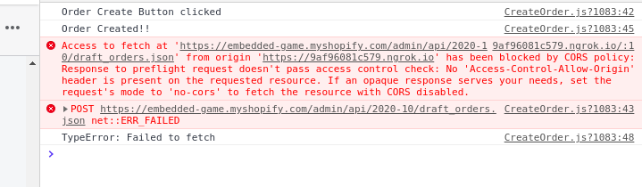

# Shopify-embedded-app

## Pre-requisites

* [Create a Shopify partner account](https://partners.shopify.com/signup).
* Create an App in [Shopify Development store](https://help.shopify.com/en/partners/dashboard/development-stores#create-a-development-store) where you can install and test your app.
* In the Partner dashboard, [create a new app](https://help.shopify.com/en/api/tools/partner-dashboard/your-apps#create-a-new-app). You’ll need this app’s API credentials during the setup process.
* Survey Sparrow Account
* ngrok installed
* Node runtime environment with dependencies installed

> In our case, store is **embedded-game** and app is **Sample Embedded App**.

## Setting up the Environment

* On First Ternimal
  * run: `npm start dev`
* On Second Terminal
  * run: `ngrok http 3000`

</img>

* Copy the ngrok gateway address and add it in shopify app setup. 

</img>
[**Note**: Shopigy only uses https]

* Your app will run on: 
Link: 
`https://<ngrok_gateway>.ngrok.io/auth?shop=<app_name>.myshopify.com`
   In our case:  
`https://87319a0c345a.ngrok.io/auth?shop=embedded-game.myshopify.com`

***

## SurveySparrow **><** Shopify

</img>
</img>

***

## Images 
### Embedded app inside Shopify

</img>

### Stand-alone app

</img>

### Order Selector

</img>

## Converting Embedded to Non-Embedded App

An embedded app appears within the Shopify environment through an iframe and should be an organic experience for the user. A non-embedded app is one that is external and to which you are re-directed to when clicking on the app in the `admin/apps` section

To convert Embedded to Non-Embedded App, we only have to change ***forceRedirect*** key in **config** file in **_app.js**.

</img>

## Adding SurveySparrow in embedded app
Option to add our compant logo is avaliable in shopify app setup. 

</img>

## Use cases

* **Authentication** Fuctionality at:*https://<ngrok_gateway>/auth?shop=embedded-game.myshopify.com*
* Once logged in, you'll be inside your app (which can be *embedded using iframe*).
* In your app, you can use *GraphQL API* to perform **CRUD operations** on **Products, customers, orders, etc.**
* The input fields for above operations can be taken using **SurveySparrow conversational forms**
* Listen for store events with webhooks. We can implement webhooks to trigger at a specific event and notify users of the same. 

## Implemented 
* Authentication Functionality. `Shopify API`
* **Getting Existing Customers** in Store using `Shopify API`  and **Sending SurveySparrow Review Form** to them through Mail using `SurveySparrow API`.
* Sending SurveySparrow form through email to **add new customers** `SurveySparrow API`.
* Getting all Products avaliable in Store `Shopify API`.

**Note**: I have planned to add new customer in Shopify Store by sharing SurveySparrow Form to get their data and storing same data in Shopify Store.

*Api endpoints of the above tasks are already implemented by wasn't able to make GET or POST request to SurveySparrow or Shopify due to **CORS Error***

</img>

## About API

For sharing Survey through emails
  * Create a Survey(you will get `survey_id`)
  * Create a Email Share Link(you will get `share_id`)
  * Using share_id you can send survey to an `array of emails`

API Endpoint: `https://api.surveysparrow.com/v1/shares/email/<share_id>`

> We are using the about technique to share the Shopify **order creation form** and **Order Review form** with the customers through **email**.

Complete api details and work done on Postman is shared [here](https://github.com/abhishek2x/Postman-Collection-Backup/blob/main/SurveySparrow.postman_collection.json)

[*Shopify Order API Documentation*](https://shopify.dev/docs/admin-api/rest/reference/orders/order)  

## Technology Stack

- React
- Next.js 
- Appolo-GraphQL
- Shopify Tools
  - shopify/app-bridge-react
  - shopify/koa-shopify-auth
  - shopify/koa-shopify-graphql-proxy
  - shopify/polaris
  
***

## License

This respository is available as open source under the terms of the [MIT License](https://opensource.org/licenses/MIT).
